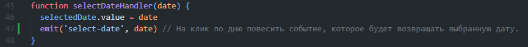
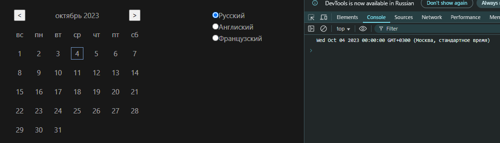
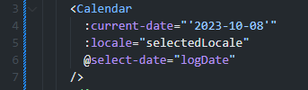
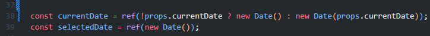
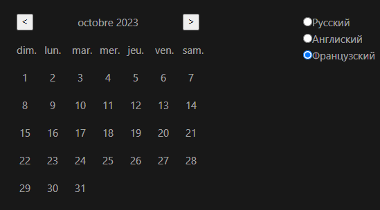

# Тестовое задание для компании "Рабочие руки"

## На клик по дню повесить событие, которое будет возвращать выбранную дату. ✅


## При инициализации компонент может принимать свойство даты в формате "год-месяц-день" и переключать текущий месяц и день на нее. Если дата не передана, то берем текущий день. ✅



## Реализовать возможность смены языка (название месяцев, дней недели). ✅



## Запуск проекта

```sh
npm install
```

```sh
npm run dev
```
